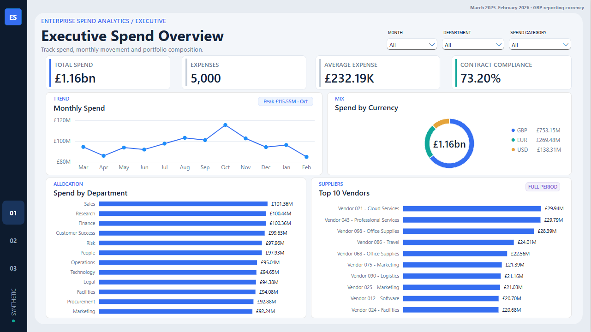
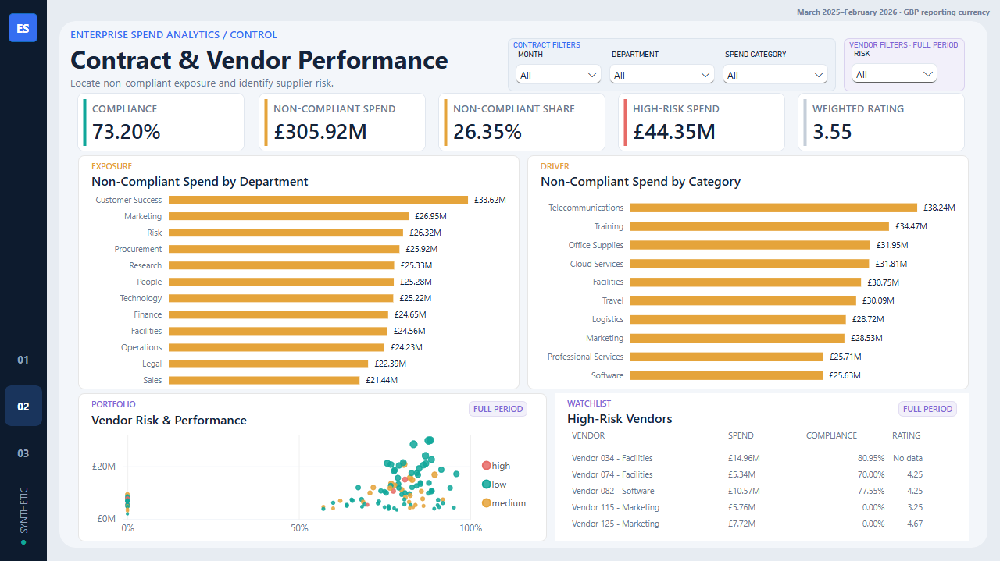
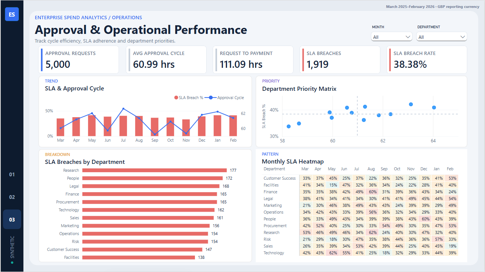

# Enterprise Spend Analytics Pipeline

An end-to-end analytics engineering portfolio project that takes public and synthetic spend data through **Python → MySQL → dbt → Airflow → Power BI**. The project demonstrates source preservation, data-quality controls, multi-currency conversion, dimensional modelling, idempotent loading, orchestration, reconciliation, and management reporting.

> **Data boundary:** the 13,830 DEFRA rows are real UK government open data. The corporate expenses, vendors, contracts, approvals, satisfaction scores, and all Power BI business findings are deterministic fictional data. The two origins are never represented as one real company dataset.

## Architecture

```text
DEFRA monthly CSVs ──► Python profiling & quality rules ───────────────┐
                                                                       │
Synthetic generator + cached Frankfurter FX ─► Python validation ─► MySQL
                                                                       │
                                               dbt Core ◄──────────────┘
                                  staging ─► intermediate ─► marts/tests
                                                        │
                                      Airflow orchestration & controls
                                                        │
                                       Power BI management dashboard
```

- **Python:** reproducible profiling, deterministic generation, FX matching, quarantine, ingestion, and control checks.
- **MySQL 8:** 10 raw/fact/control tables with idempotent upserts.
- **dbt Core:** 17 models and 73 data tests across staging, intermediate, and mart layers.
- **Airflow:** ordered ingestion → dbt build → reconciliation → summary, with retries and downstream failure containment.
- **Power BI:** a three-page report connected to five governed dbt marts.

Detailed designs: [data model](docs/data_model.md), [dbt layer](docs/phase4_dbt_design.md), [Airflow architecture](docs/phase5_airflow_architecture.md), and [Power BI specification](docs/phase6_powerbi_design.md).

## Validated results

| Layer | Result |
|---|---:|
| DEFRA source | 12 files · 13,830 rows |
| Exact repeated occurrences | 134 retained for review |
| Source-month discrepancies | 72 retained with both dates |
| Synthetic expenses | 5,000 (GBP 3,000 · EUR 1,250 · USD 750) |
| Approval events | 20,000 |
| Reconciled GBP spend | **£1,160,936,638.63** |
| MySQL live verification | **19/19 passed** · second load unchanged |
| dbt live build | **90/90 nodes passed** |
| Airflow live reconciliation | **24/24 passed** on two complete runs |
| Power BI | 3 pages · 5 dbt marts · 1280×720 canvases |
| Final Python regression | **19/19 passed** |

The current scenario shows 73.20% contract compliance, £305.92m non-compliant spend, a 38.38% approval SLA breach rate, 60.99 average approval hours, and 111.09 average request-to-payment hours. These are fictional scenario findings, not DEFRA performance claims.

Evidence is stored in the concise reports under `reports/`, including [data quality](reports/data_quality_report.md), [MySQL verification](reports/mysql_live_verification.md), [dbt verification](reports/dbt_live_verification.md), [Airflow verification](reports/airflow_live_verification.md), and [business findings](reports/phase6_business_findings.md).

The combined verification record is in [final end-to-end verification](reports/final_end_to_end_verification.md).

## Dashboard

The final report is [Enterprise_Spend_Analysis_Pipeline.pbix](powerbi/Enterprise_Spend_Analysis_Pipeline.pbix). It deliberately consumes dbt marts instead of recreating transformations in Power Query.

### Executive Spend Overview



Tracks total spend, transaction volume, monthly movement, currency mix, department spend, and leading vendors.

### Contract & Vendor Performance



Surfaces contract compliance, non-compliant spend, high-risk exposure, category and department drivers, and vendor performance.

### Approval & Operational Performance



Monitors approval cycle time, request-to-payment time, SLA breaches, monthly movement, and department-level operational performance.

See the [Power BI QA report](reports/powerbi_qa_report.md) for package checks, rendered review status, and known limitations.

## Data-quality design

- `source_record_id` is a deterministic lineage key; the incomplete and non-unique transaction number remains a business attribute.
- Exact duplicates and business-duplicate candidates are flagged, not silently deleted.
- `source_month` and `transaction_date` are retained separately.
- Hard failures such as invalid dates, currencies, foreign keys, or amounts are quarantined without changing source files.
- A zero quarantine count means no hard rule failed; it does not mean the data is free of warnings.
- Historical EUR/USD rates use the latest available rate on or before the transaction date, with `Decimal` arithmetic and a local cache.

## Repository structure

```text
config/               deterministic scenario configuration
data/raw/defra/       preserved DEFRA open-data source files
data/raw/fx_rates/    cached Frankfurter responses for offline reruns
src/                  profiling, generation, validation, ingestion and analysis
sql/ddl/              MySQL schema definitions
dbt/                  sources, staging, intermediate, marts, tests and docs
airflow/              Docker runtime and production DAG
powerbi/              final PBIX report
tests/                clone-safe regression tests
docs/                 architecture, models, dictionaries and report design
reports/              concise, reviewable validation evidence
```

Generated row-level synthetic/processed data, runtime logs, local credentials, virtual environments, Power BI prototypes, and temporary exports are excluded from Git. See [repository contents](docs/repository_contents.md) for the final include/exclude policy.

## Reproduce locally

### Python profiling and deterministic data

Python 3.11+ is required. The generation path can run offline from the tracked FX cache.

```powershell
python -m src.profiling.profile_defra
python -m src.synthetic.generate_phase3 --offline
python -m src.validation.validate_phase3
python -m unittest discover -s tests -v
```

### Live MySQL and dbt verification

The database password is requested securely or supplied through an ignored local environment file; it is never printed or committed.

```powershell
.\.venv-dbt\Scripts\python.exe -m src.ingestion.verify_mysql_phase3
.\.venv-dbt\Scripts\python.exe -m src.ingestion.verify_dbt_phase4
```

Tested versions: MySQL 8.0.46, dbt Core 1.7.19, and dbt-mysql 1.7.0.

### Airflow

Airflow runs in Docker Desktop/WSL2 and connects to the existing Windows MySQL instance. Create the ignored local settings file and start the services:

```powershell
powershell -ExecutionPolicy Bypass -File .\scripts\setup_airflow_env.ps1
docker compose --env-file airflow\.env -f airflow\docker-compose.yml build
docker compose --env-file airflow\.env -f airflow\docker-compose.yml up airflow-init
docker compose --env-file airflow\.env -f airflow\docker-compose.yml up -d
```

The UI is available at `http://localhost:8080`. The scheduled production DAG runs at 06:00 UTC on day 2 of each month with catch-up disabled.

## Limitations

- The dbt/Power BI corporate analysis is synthetic by design; it demonstrates engineering and analytical methods rather than making claims about DEFRA.
- Source hashes verify the preserved repository files against the inventory, not byte identity with every current remote GOV.UK download.
- The PBIX requires a local MySQL connection and user-managed credentials to refresh outside the original machine.
- `dbt-mysql` is community maintained; production adoption would require an adapter/support review.

DEFRA source provenance and Open Government Licence attribution are documented in [source provenance](docs/source_provenance.md).
