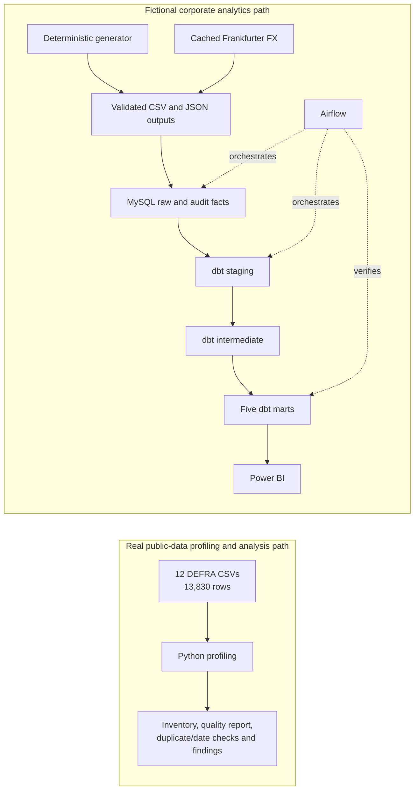

# Implemented architecture

This repository contains two deliberately separate data paths. The real DEFRA
path demonstrates source discovery, data-quality engineering, and descriptive
spend analysis. The fictional
corporate path demonstrates the operational analytics stack. They share
engineering principles, but their records are never combined or described as
one organisation's spend.

## Responsibility boundaries

| Component | Implemented responsibility |
|---|---|
| Python | DEFRA profiling; deterministic fictional data generation; cached historical FX matching; hard-rule validation and quarantine; idempotent MySQL loading. |
| MySQL 8 | Seven fictional/FX raw tables, two audit fact tables, one load-run control table, and two freshness audit tables. No DEFRA table is loaded. |
| dbt Core | Seven staging views, five intermediate views, five mart tables, and 73 data tests for the fictional scenario. |
| Airflow | A local Docker/WSL2 six-task workflow: preflight, ingestion, dbt build, reconciliation, freshness monitoring, and summary. It does not execute DDL. |
| Power BI | Three pages backed by five dbt marts. It contains fictional corporate analysis only. |

## Controls

- Stable source identifiers and upserts make repeated MySQL loads idempotent.
- `record_origin`, `scenario_id`, and `is_synthetic` preserve the data boundary.
- Financial calculations use `Decimal`; the applied FX rate and rate date are retained.
- Contract compliance is determined from vendor, category, and validity dates,
  not from the presence of a contract number alone.
- Airflow serialises writes, stops downstream tasks on failure, and reconciles
  counts and totals after dbt completes.
- Freshness checks separate current load recency from completeness of the fixed
  historical scenario and block publication when a rule fails.
- Credentials are supplied through ignored local environment files or secure
  prompts and are not stored in the repository.

## Explicit scope boundary

`fact_defra_spend` and DEFRA dbt marts were part of an early target-state design
but were not implemented. The public DEFRA files remain a profiled descriptive
analysis case study; the operational MySQL/dbt/Airflow/Power BI path begins with the
fictional corporate scenario and real reference FX rates.
