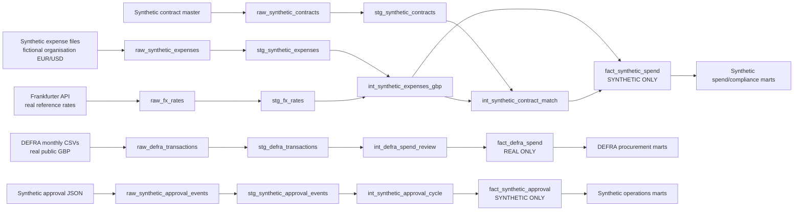

# Proposed architecture

## Layer flow

## Responsibilities

| Layer | Purpose | Mutability and controls |
|---|---|---|
| Raw | Lossless source representation plus file/API lineage. | Append/idempotent load; no source-value correction. Raw primary key is source-scoped. |
| Staging | Canonical names, typed dates/amounts, trimming policy, quality statuses. | One model per source; quarantined rows excluded from accepted staging but retained in a rejection table. |
| Intermediate | Duplicate review, GBP conversion, contract matching, and approval-cycle derivations. | Business logic remains source-specific. DEFRA blanks never inherit synthetic contracts. |
| Mart | Stable fact/dimension grains for analysis. | Separate real and synthetic facts. Shared dimensions use source-scoped natural keys. |

## Idempotency and lineage

1. Register a file by SHA-256 and controlled `source_month`.
2. Generate `source_record_id` deterministically from source file, row number, and source-value hash.
3. Load with a unique constraint on `source_record_id`; a repeated identical run becomes a no-op.
4. If a publisher replaces a file under the same name, its file hash changes. Store a new ingestion version and require an explicit supersession decision instead of silently overwriting history.
5. Carry `source_record_id` into every downstream fact so any metric can trace to file and row.

## Quarantine boundary

Hard failures are invalid/missing transaction date, invalid/missing numeric amount, missing lineage, or an unexpected schema that cannot be mapped unambiguously. Soft warnings include source-month discrepancies, exact repeats, repeated business identifiers, blank contract/project/transaction references, non-positive amounts, and values below the publication threshold. Warnings stay in the accepted population with flags.

