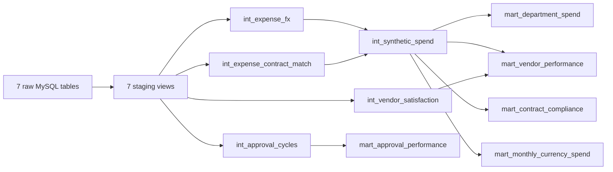

# Implemented data model

## MySQL source and audit layer

| Table | Grain | Key / relationship |
|---|---|---|
| `pipeline_load_run` | One deterministic generation run | `generation_run_id` |
| `pipeline_freshness_run` | One freshness evaluation per Airflow run | Hashed `monitor_run_id`; stores policy and overall result |
| `pipeline_freshness_result` | One freshness rule result per evaluation | `monitor_run_id` + `rule_id`; FK to freshness run |
| `raw_synthetic_department` | One fictional department | `department_id` unique |
| `raw_synthetic_vendor` | One fictional vendor | `vendor_id` unique |
| `raw_synthetic_contract` | One fictional contract | `contract_id`; FK to vendor |
| `raw_synthetic_expense` | One fictional expense | `expense_id`; FKs to department, vendor, optional submitted contract |
| `raw_fx_rate` | One date/base/quote/provider observation | `fx_rate_id`; observation tuple unique |
| `raw_synthetic_approval_event` | One workflow event | `event_id`; unique expense + sequence |
| `raw_synthetic_vendor_satisfaction` | One survey response | `response_id`; FK to vendor |
| `fact_synthetic_spend` | One transformed fictional expense | `expense_id`; matched contract and applied FX lineage |
| `fact_synthetic_approval` | One derived workflow per expense | `expense_id`; ordered workflow timestamps |

The full constraints are executable in
[`sql/ddl/phase3_mysql.sql`](../sql/ddl/phase3_mysql.sql). The two Python facts
are reconciliation baselines; dbt builds its models from the seven raw tables.
The additive monitoring audit schema is executable in
[`sql/ddl/freshness_monitoring.sql`](../sql/ddl/freshness_monitoring.sql).

## dbt transformation layer

| Model | Grain | Rows in verified run |
|---|---|---:|
| `int_expense_fx` | One fictional expense with selected historical FX rate | 5,000 |
| `int_expense_contract_match` | One fictional expense with match decision | 5,000 |
| `int_synthetic_spend` | One analysis-ready fictional expense | 5,000 |
| `int_approval_cycles` | One fictional expense workflow | 5,000 |
| `int_vendor_satisfaction` | One surveyed fictional vendor | varies by response coverage |
| `mart_department_spend` | One department for the full period | 12 |
| `mart_vendor_performance` | One vendor for the full period | 125 |
| `mart_contract_compliance` | Month × department × category × compliance status | 2,918 |
| `mart_approval_performance` | Month × department | 144 |
| `mart_monthly_currency_spend` | Month × original currency | 36 |

The five marts are aggregate facts at different grains. Power BI uses a month
dimension and the department mart as a lookup where valid; it does not join the
marts directly or create unsupported many-to-many relationships.

## Identifier decisions

- `source_record_id` is the deterministic lineage and idempotency key.
- Business identifiers such as `expense_id`, `vendor_id`, and `contract_id`
  are scenario-scoped and constrained at their declared grains.
- The real DEFRA `transaction_number` is incomplete and non-unique, so it is
  retained as an attribute in the profiling output rather than used as a key.
- Real DEFRA and fictional corporate records have no cross-source relationship.
