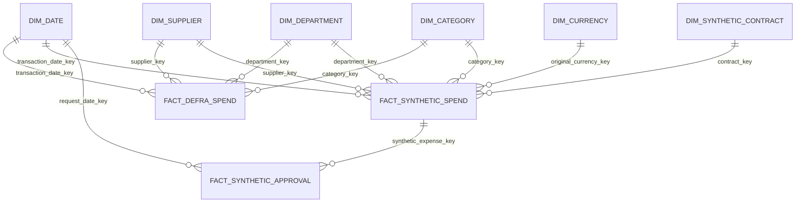

# Proposed data model

## Entity relationship diagram

`DIM_SUPPLIER`, `DIM_DEPARTMENT`, and `DIM_CATEGORY` use a `source_dataset` namespace in their natural-key uniqueness constraints. Matching labels do not imply that a DEFRA entity and a fictional organisation are the same member.

## Table grains and keys

| Layer / table | Grain | Primary key | Business/natural key and relationships |
|---|---|---|---|
| `raw_ingestion_run` | One ingestion attempt for one file/API request. | `ingestion_run_id` surrogate | Unique successful file version on `(source_system, source_file, file_sha256)`. |
| `raw_defra_transactions` | One physical source row in one DEFRA CSV version. | `source_record_id` deterministic | Keeps transaction number as non-unique attribute; FK to ingestion run. |
| `raw_synthetic_expenses` | One generated expense row in the fictional organisation dataset. | namespaced `source_record_id` | Unique `(scenario_id, synthetic_expense_id)`. Never uses DEFRA namespace. |
| `raw_fx_rates` | One rate for rate date, base currency, quote currency, and provider. | `fx_rate_observation_id` | Unique `(provider, rate_date, base_currency, quote_currency)`. |
| `raw_synthetic_contracts` | One version of one fictional contract. | `contract_version_id` | Unique `(scenario_id, contract_id, valid_from)`. |
| `raw_synthetic_approval_events` | One workflow event. | `approval_event_id` | FK to synthetic expense only. |
| `stg_defra_transactions` | One accepted DEFRA source row. | `source_record_id` | 1:1 with raw row; typed fields and quality flags. |
| `stg_*_rejections` | One rejected source row and one reason set. | `rejection_id` | FK to raw record and ingestion run. |
| `stg_synthetic_expenses` | One accepted fictional expense. | `source_record_id` | FK to its scenario; retains original currency/amount. |
| `int_defra_spend_review` | One DEFRA source row plus duplicate grouping and inclusion status. | `source_record_id` | Exact and business-candidate group IDs are non-unique review fields. |
| `int_synthetic_expenses_gbp` | One fictional expense with one selected historical FX observation. | `source_record_id` | FK to `raw_fx_rates`; stores applied rate date and GBP amount. |
| `int_synthetic_contract_match` | One fictional expense-to-contract match decision. | `source_record_id` | FK to synthetic contract version; no relationship to DEFRA contract text. |
| `int_synthetic_approval_cycle` | One fictional approval request with derived cycle measures. | `approval_request_id` | Derived from ordered approval events. |
| `fact_defra_spend` | One accepted DEFRA source row as published, including duplicate warnings. | `defra_spend_key` surrogate | Unique `source_record_id`; FKs to source-scoped dimensions. Transaction number is a degenerate attribute. |
| `fact_synthetic_spend` | One fictional expense transaction. | `synthetic_spend_key` surrogate | Unique `(scenario_id, synthetic_expense_id)`; FKs to FX observation and synthetic contract. |
| `fact_synthetic_approval` | One fictional approval request. | `approval_key` surrogate | FK to `synthetic_spend_key`; approval duration and SLA outcome. |
| `dim_supplier` | One source-scoped supplier member/version. | `supplier_key` surrogate | Unique `(source_dataset, supplier_natural_key, valid_from)` for an SCD2 option. |
| `dim_department` | One source-scoped department/entity member. | `department_key` surrogate | Unique `(source_dataset, department_natural_key)`. |
| `dim_category` | One source-scoped canonical category. | `category_key` surrogate | Source mapping table records the original labels. |
| `dim_date` | One calendar day. | `date_key` integer `YYYYMMDD` | Shared only because dates have common semantics. |
| `dim_currency` | One ISO currency. | `currency_key` surrogate | Unique ISO-4217 code. |
| `dim_synthetic_contract` | One valid-time version of a fictional contract. | `contract_key` surrogate | Unique scenario-scoped contract/version. |

## Duplicate handling in the fact

All accepted source rows enter `fact_defra_spend` by default because the source publication itself is the observable evidence. The fact exposes `exact_duplicate_group_id`, `business_duplicate_group_id`, `duplicate_review_status`, and `source_record_id`. A separate sensitivity mart may show totals excluding reviewer-confirmed duplicates, but no transformation may infer that status from row equality alone.

## Transaction identifier decision

`transaction_number` is missing on 123 current rows and repeats with both identical and differing content. It cannot be a primary key. The raw key is `source_record_id`; the mart key is a surrogate; the transaction number remains available for review and drill-through.

